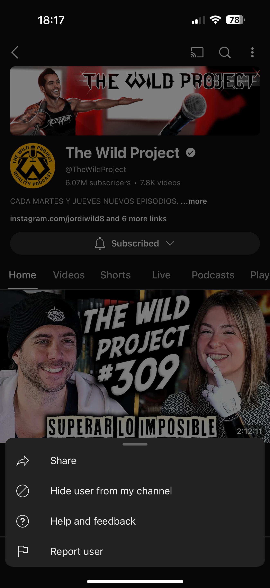
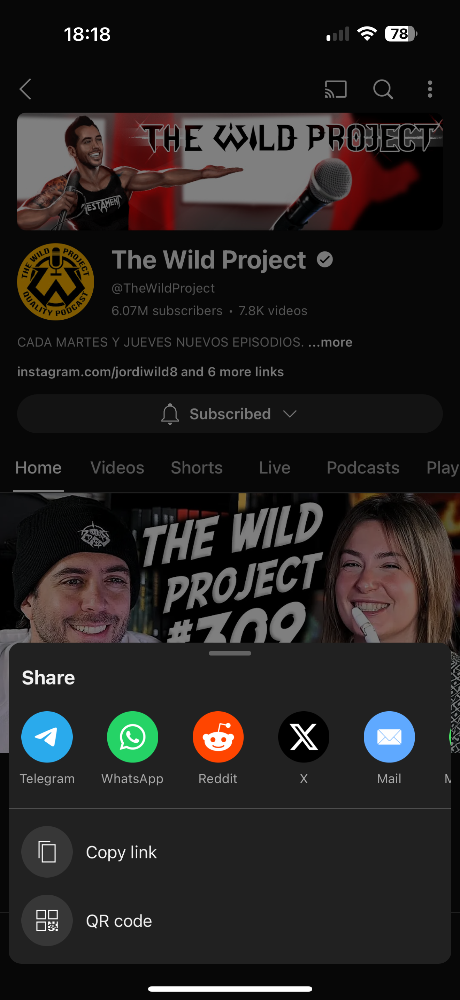
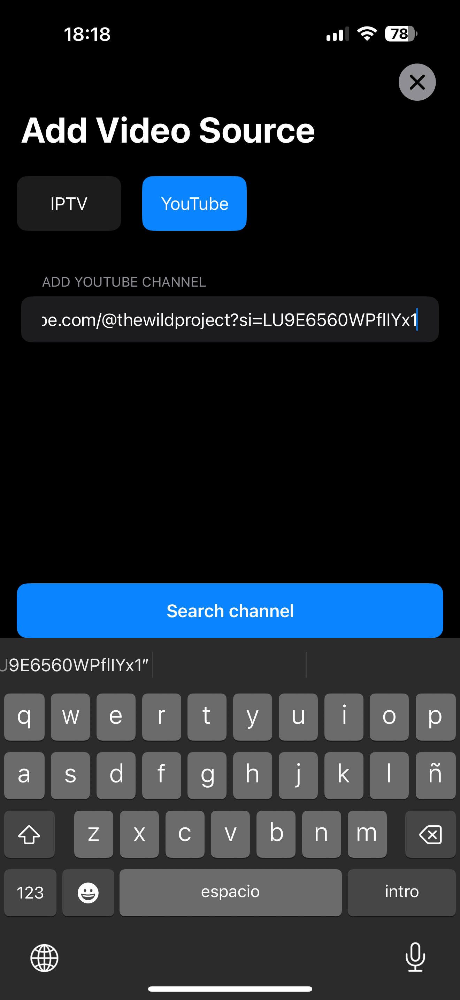

# Añadir vídeo youtube a GoVideo

## Paso 1: Ir a la aplicación de Youtube
1. Buscar el canal que queremos añadir  
   
2. Pulsar en el botón superior derecha  
   
3. Darle al botón de compartir  
   
4. Copiar URL del canal  
   

## Paso 2: Añadir el canal de youtube en GoVideo
1. En la Home darle al botón  
   
2. Seleccionar el tipo Youtube  
3. Pegar URL del canal de youtube  
   
4. Darle al botón de guardar canal  
   

   

## Descargar aplicación
- [Enlace en la App Store](https://apps.apple.com/es/app/govideo/id6467807623)
